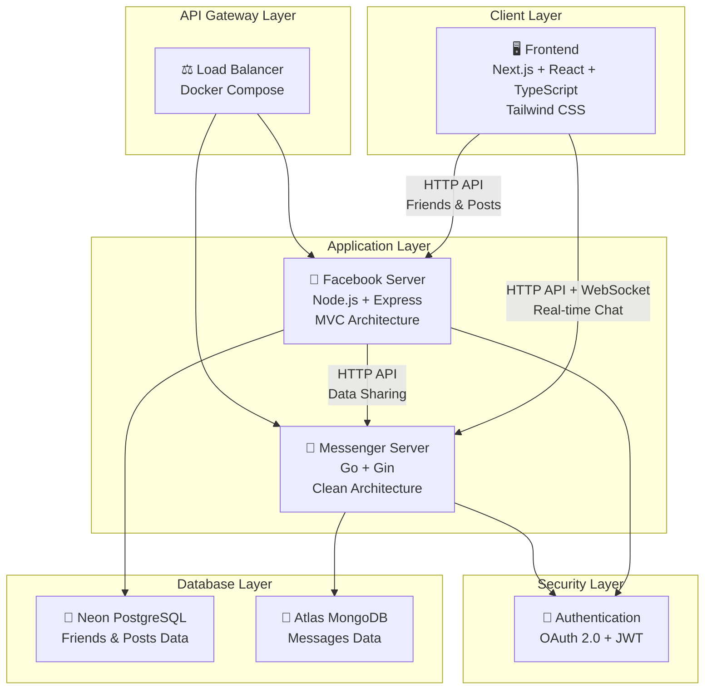
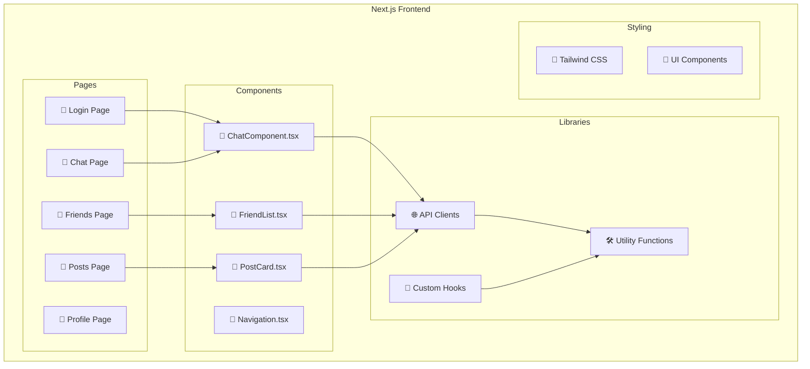
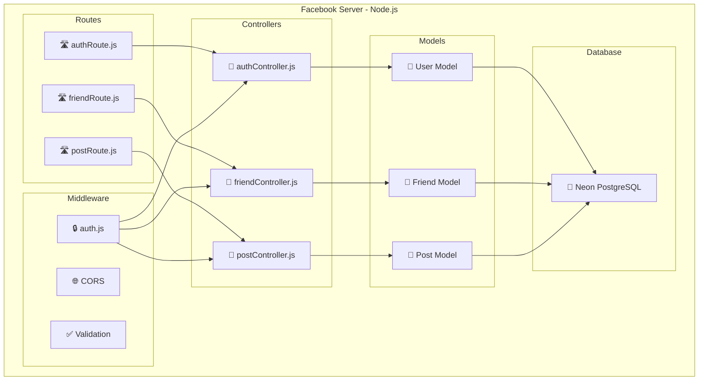
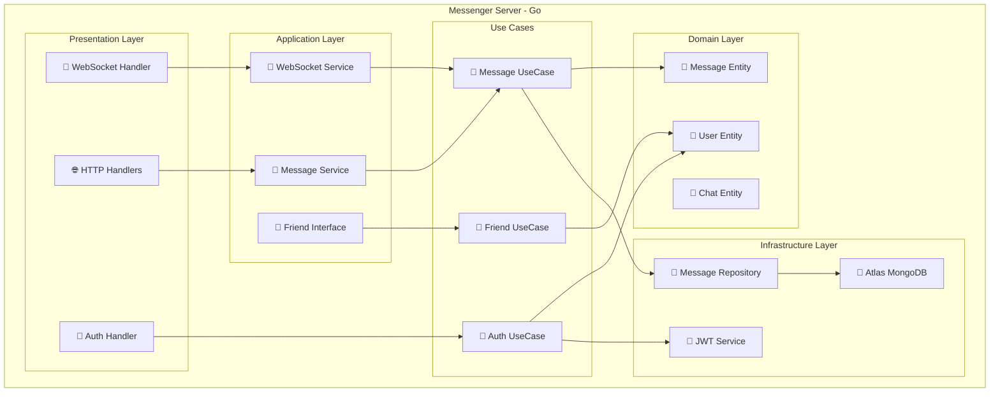
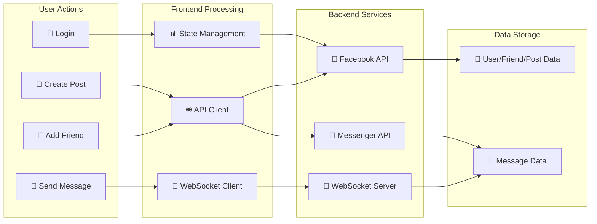
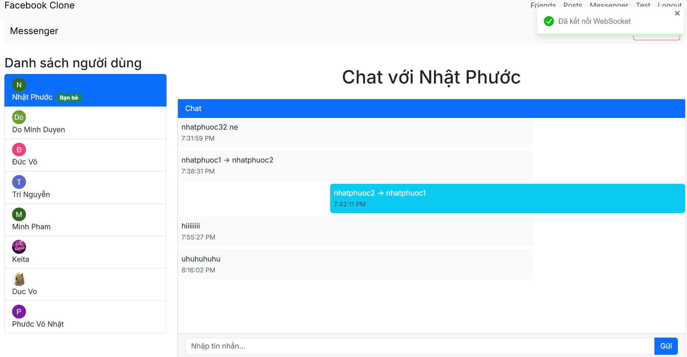
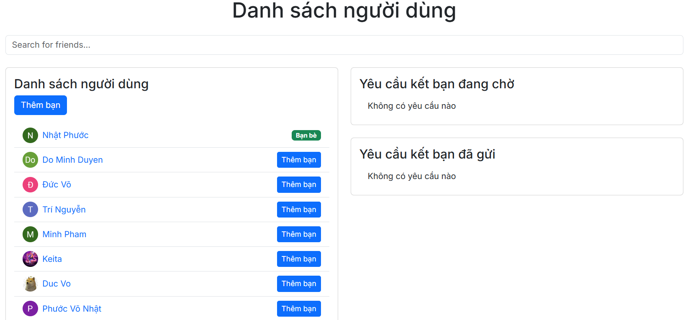

# README: FACEMESS System Architecture

## Introduction
FACEMESS is an integrated application that combines social networking and real-time messaging functionalities. The system comprises three main components: Frontend, Facebook Server, and Messenger Server. These components are designed to operate independently while collaborating seamlessly to deliver a smooth user experience.



### Tools & Integrations
<p align="center">
  <a href="https://skillicons.dev">
    
  </a>
</p>

- Front-End: Next.js, Tailwind CSS, React 
- Back-End: Go(Gin), Nodejs(Express), Oauth2.0,  JWT, WebSocket(Gorilla)
- Database: MongoDB, PostgreSQL(Neon)
- DevOps: Docker

## System Architecture

### 1. Frontend
- **Technologies**: Next.js, TypeScript, Tailwind CSS, React
- **Description**: Provides a user-friendly and responsive interface, including pages such as Login, Profile, Friends, Posts, and Chat.
- **Structure**:
  - `app`: Contains pages and core logic (e.g., `chat`, `friends`, `login`, `post`, `profile`).
  - `components`: Houses reusable UI components (e.g., `ChatComponent.tsx`, `FriendList.tsx`).
  - `lib`: Contains utility functions.
- **Role**: Serves as the primary user interaction point, communicating with backend servers via HTTP API and WebSocket.



### 2. Facebook Server
- **Technologies**: Node.js, Express, OAuth, JWT, Neon PostgreSQL
- **Description**: Manages friend connections and post operations (CRUD).
- **Architecture**: Follows the MVC (Model-View-Controller) pattern.
- **Structure**:
  - `controllers`: Handles business logic (e.g., `authController.js`, `friendController.js`).
  - `models`: Defines data structures (e.g., `friend.js`, `post.js`).
  - `routes`: Defines API endpoints (e.g., `authRoute.js`, `friendRoute.js`).
  - `middleware`: Manages common functionalities like authentication (e.g., `auth.js`).
- **Database**: Neon PostgreSQL.
- **Role**: Processes requests from the Frontend related to friends and posts.

### 3. Messenger Server
- **Technologies**: Go, Gin, Gorilla WebSocket, OAuth 2.0, JWT, Atlas MongoDB
- **Description**: Handles real-time messaging.
- **Architecture**: Follows the Clean Architecture pattern.
- **Structure**:
  - `domain`: Contains core entities (e.g., `message.go`, `user.go`).
  - `usecases`: Contains business logic (e.g., `auth_usecase.go`, `message_use_case.go`).
  - `application`: Contains interfaces and services (e.g., `friend_interface.go`, `message_service.go`).
  - `infrastructure`: Implements infrastructure services like database access (e.g., `message_repository.go`).
  - `presentation/http`: Manages HTTP and WebSocket requests (e.g., `handlers/auth.go`, `handlers/websocket.go`).
- **Database**: Atlas MongoDB.
- **Role**: Facilitates real-time communication via WebSocket and provides HTTP APIs for chat initialization.


### 4. Containerization
- **Technologies**: Docker
- **Description**: The entire system is containerized for easy deployment and management.
- **Configuration**: Uses `docker-compose.yml` to orchestrate containers.

### 5. Data Flow Architecture
- **Frontend ↔ Facebook Server**: Communicates via HTTP API for friend and post-related functionalities.
- **Frontend ↔ Messenger Server**: Communicates via HTTP API for chat initialization and WebSocket for sending/receiving messages in real-time.
- **Facebook Server ↔ Messenger Server**: Shares necessary data via HTTP API.



### 6. Security
- Both servers (Facebook Server and Messenger Server) utilize OAuth and JWT for user authentication and authorization.

## Deployment
- The system is containerized with Docker.
- Docker Compose is used to manage and deploy services.
- Concurrently can be used to run the system.

## Technology Summary 
| Component          | Technologies Used                                      |
|--------------------|-------------------------------------------------------|
| Frontend           | Next.js, TypeScript, Tailwind CSS, React              |
| Facebook Server    | Node.js, Express, OAuth, JWT, Neon PostgreSQL         |
| Messenger Server   | Go, Gin, Gorilla WebSocket, OAuth 2.0, JWT, Atlas MongoDB |
| DevOps             | Docker, Docker Compose, Concurrently                  |

## Conclusion
FACEMESS is designed with a clear, modular architecture to ensure scalability and maintainability. The Frontend provides a user interface, while the backend servers (Facebook Server and Messenger Server) handle specific functionalities using different architectures (MVC and Clean Architecture). The system is secured with OAuth and JWT and containerized with Docker for easy deployment.

## B. How to Run the Project
After cloning the project from GitHub, configure the required `.env` files for each server as follows:

### Frontend
```
FACEBOOK_SERVICE_URL=
MESSENGER_SERVER_URL=
CLOUDINARY_CLOUD_NAME=
CLOUDINARY_API_KEY=
CLOUDINARY_API_SECRET=
GOOGLE_CLIENT_ID=
GOOGLE_CLIENT_SECRET=
GOOGLE_REDIRECT_URI=
NEXT_PUBLIC_API_URL=
NEXT_PUBLIC_GOOGLE_AUTH_URL=
NEXT_PUBLIC_MESSENGER_SERVER_URL=
NEXT_PUBLIC_FB_SERVER_URL=
NODE_ENV=
PORT=
```

### Facebook Server
```
PORT=
NODE_ENV=
DATABASE_URL=
JWT_SECRET=
CLOUDINARY_CLOUD_NAME=
CLOUDINARY_API_KEY=
CLOUDINARY_API_SECRET=
GOOGLE_CLIENT_ID=
GOOGLE_CLIENT_SECRET=
GOOGLE_CALLBACK_URL=
```

### Messenger Server
```
MONGO_URL=
JWT_SECRET=
FACEBOOK_SERVICE_URL=
CLOUDINARY_CLOUD_NAME=
CLOUDINARY_API_KEY=
CLOUDINARY_API_SECRET=
GOOGLE_CLIENT_ID=
GOOGLE_CLIENT_SECRET=
GOOGLE_REDIRECT_URI=
GO_ENV=
PORT=
```

Follow these steps to set up and run the project:
1. Install dependencies for each component using `npm install` or equivalent.
2. Configure the `.env` files with the appropriate values.
3. Use `docker-compose up --build` to start the containers, or run each server individually with `npm start` (or equivalent) and concurrently if needed.

### Some Screen



